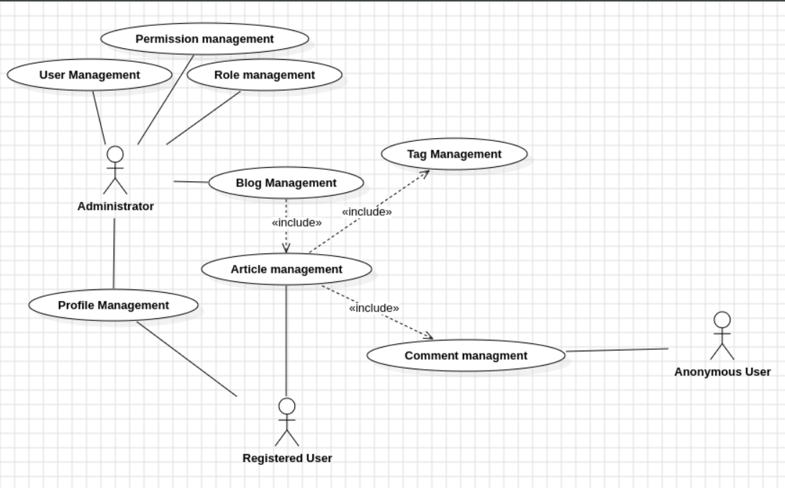

##  Actores:
1. [Administrator](#introduction)  
2. [Author](#paragraph1)
3. [Registered User](#paragraph2)  
4. [Anonymous User](#paragraph3)  Usuario Anónimo

##  Casos de Uso:
1. [Article Managment](#introduction) 
2. [User Management](#paragraph1)
3. [Role Management](#paragraph1)
4. [Permission Management](#paragraph1)
5. [Comment Managment](#paragraph2) 
6. [Tag Management](#paragraph3) 
7. [Blog Management](#paragraph3) 
8. [Profile Management](#paragraph3) 

